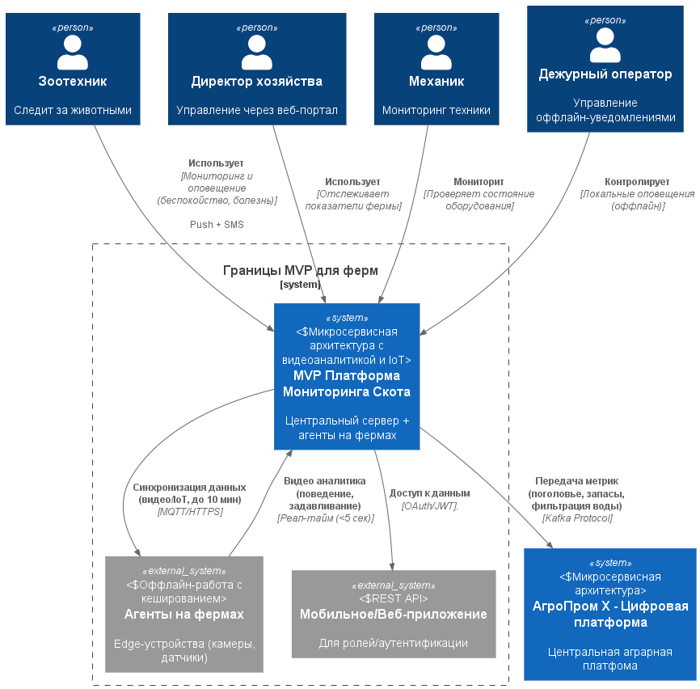
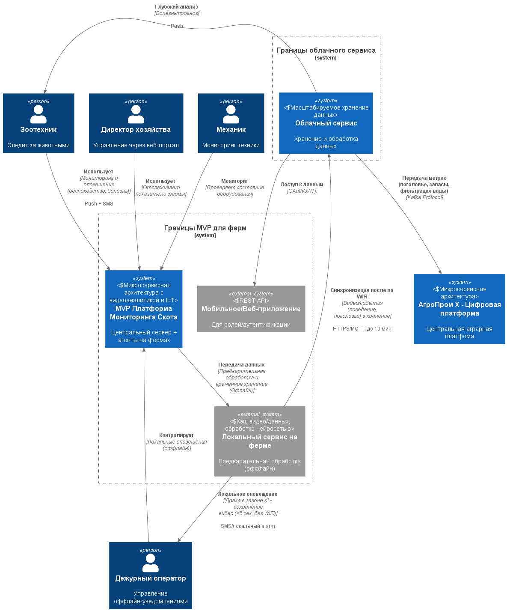

### **Название задачи:** Выбор архитектуры MVP для мониторинга скота
### **Автор:** Швецов Александр
### **Дата:** 01.10.2025
### **Функциональные требования**

| **№** | **Действующие лица или системы** | **Use Case** | **Описание** |
| :---: | :------------------------------- | :----------- | :----------- |
| 1 |   Дежурный оператор, Агент на ферме   | Получение оповещения о беспокойном поведении или драке                                              | 1. Камеры фиксируют движение/поведение скота в реальном времени.   2. Нейросеть анализирует видео (детекция драки/задавливания). 3. При событии: локальное оповещение (SMS/сирена) отправляется оператору (<5 сек).  4. Видео/данные кэшируются локально.|
|2| Зоотехник, Центральный сервер | Оценка состояния животных и прогноз запасов | 1. Синхронизация данных с агентов (до 10 мин). 2. Сервер анализирует видео/датчики (болезнь, поголовье). 3. Генерируется отчёт/уведомление в мобильное/веб-приложение. 4. Прогноз расхода корма на основе метрик.|
|3| Директор, API-клиент | Управление ролями и метриками | 1. Аутентификация через OAuth/JWT. 2. Доступ к дашборду (роли: просмотр/редактирование). 3. Передача базовых метрик в legacy-системы (Kafka). 4. Добавление кастомных метрик. |

### **Нефункциональные требования**
Опишите здесь нефункциональные требования и архитектурно значимые требования.

| **№** | **Требование**                                                                                                     |
| :---: | :----------------------------------------------------------------------------------------------------------------- |
|   1   | Отказоустойчивость: 99.95% доступность системы (локальные агенты с кэшем для оффлайн).                             |
|   2   | Производительность: Оповещения <5 сек от события; видеоаналитика в реальном времени (мс); синхронизация до 10 мин. |
|   3   | Расширяемость: Новый функционал без изменений существующего (микросервисы, API для метрик).                        |
|   4   | Безопасность: Современная аутентификация (OAuth/JWT), ролевый доступ.                                              |
|   5   | Масштабируемость: Неограниченное число агентов/ферм.                                                               |
### **Решение**

#### **Основное решение**

Это децентрализованная архитектура с центральным сервером и edge-агентами на фермах. Основные компоненты:
- **MVP платформа**: Центральный сервер для аналитики, метрик и API,
- **Агенты на фермах**: Edge-устройства для сбора видео/датчиков, локальной обработки (оффлайн-кэш),
- **Интеграции**: Передача метрик в Kafka, оповещение PUSH и SMS, API для мобильного/Web интерфейсов.

#### **Альтернатива**

Гибридная архитектура с локальным сервером на ферме для первичной обработки и облачный hub для хранения и глубокого анализа данных. Основные компоненты: 
-  **MVP платформа**: Центральный сервер для координации,
-  **Локальный сервер на ферме**: Edge для первичной обработки и передачи данных,
-  **Облачное сервис**: Хранение данных и глубокий анализ,
-  **Интеграции**: Передача метрик в Kafka, синхронизация данных по WiFi оповещение PUSH и SMS, API для мобильного/Web интерфейсов.

Для начало предпологал, что будет строиться по принципу **cloud-first, on-prem-later**, но есть интернет ограничения в которые упирается вермы. Хотя у данного подхода есть плюсы: 
- быстрый и дешёвый старт для MVP,
- гибкость на начальном этапе,
- хорошая маштабируемость.
  
Но также есть недостатки: 
- зависимость от интернета,
- безопасность (конфиденциальные данные хроняться в облаке),
- при большом росте ферм в дальнейдем будет большая стоимость предоставляемых улуг.
  
По этому было принято решение сделать локальные сервера и взять облачные за альтернативу.

### **Сравнения**
#### **Системы**

| **Системы**                | **Преимущества**                                                                                                                                                                                                                              | **Недостатки**                                                                                                                                                                                             |
| -------------------------- | --------------------------------------------------------------------------------------------------------------------------------------------------------------------------------------------------------------------------------------------- | ---------------------------------------------------------------------------------------------------------------------------------------------------------------------------------------------------------- |
| **Оснавная система**       | - Высокая отказоустойчивость:   - Локальные агенты   - LoRaWAN как альтернатива WiFi - Реал-тайм видео - Поддержка неограниченного числа агентов - Безопасность (данные хроняться у себя) - Дальнейшие перспективы выгоднее | - Гибкость и сложность масштабирования - Вся ответственность за безопасность и аварийные ситуации лежит на компании - Высокие первоначальные расходы                                                 |
| **Альтернативное решение** | Масштабируемость на облачных инфраструктурах - Интеграция с существующими CRM/ERP - Низкие затраты на развертывание (без локального железа)                                                                                             | - Зависимости от интернет соединения - Безопасность и конфиденциальност (размещение своих данных у сторонних лиц) - Непредсказуемые затраты на облако - Для размещений в облаке нужны специалисты |

#### **Облочные решения**
| **Облока**           | **Преимущества**                                                                                                                                                                                        | **Недостатки**                                        |
| -------------------- | ------------------------------------------------------------------------------------------------------------------------------------------------------------------------------------------------------- | ----------------------------------------------------- |
| Yandex Cloud         | - Широкий спект услуг (Yandex Vision для видеоаналитики скота) - посекундная тарификация для гибкости  - Собственные дата центры в России  - Интеграция с Kafka - Грант 10 000 RUB на старт | - Цены выше на хранении.                              |
| VK cloud             | - Ориентация на корпоративный сегмент и гибридные решения - Сильный Big Data (для прогноза запасов) - гибридные решения (локальный + облако)                                                      | - Меньшая гибкость для малого бизнеса - Нет гранта |
| Selectel             | - Акцент на производительности (GPU для нейросетей) - DevOps-инструменты для миграции на on-prem                                                                                                     | - Нет AI аналитики                                    |
| SberCloud (cloud.ru) | - Глубокая интеграция с экосистемой Сбера (безопасность для данных) - ФСТЭК-сертификаты  - Бесплатная виртуалка - Есть IA аналитика данных                                                        |                                                       |