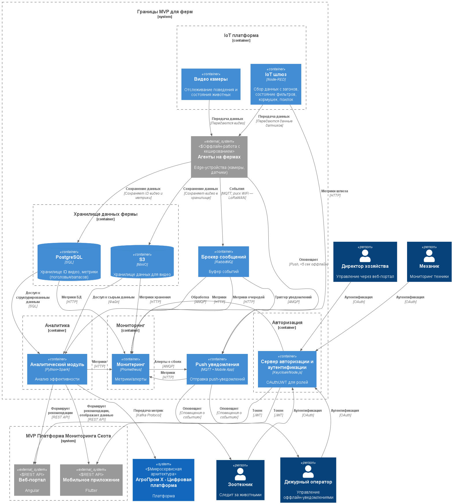
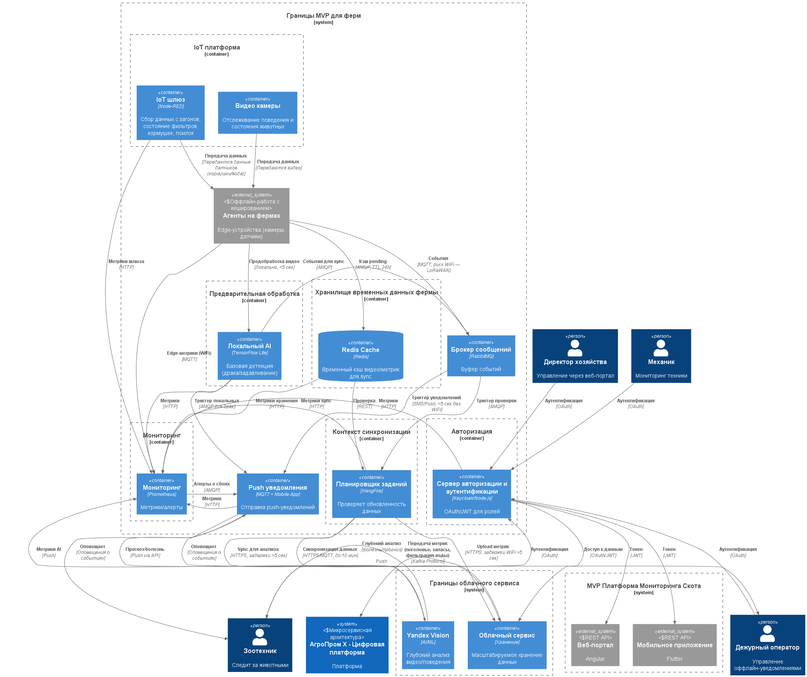

### **Название задачи:** Выбор архитектуры MVP для мониторинга скота (C2)
### **Автор:** Швецов Александр
### **Дата:** 02.10.2025
### **Функциональные требования**

| **№** | **Действующие лица или системы**  | **Use Case**                                           | **Описание**                                                                                                                                                                                                                                                       |
| :---: | :-------------------------------- | :----------------------------------------------------- | :----------------------------------------------------------------------------------------------------------------------------------------------------------------------------------------------------------------------------------------------------------------- |
|   1   | Дежурный оператор, Агент на ферме | Получение оповещения о беспокойном поведении или драке | 1. Камеры фиксируют движение/поведение скота в реальном времени.   2. Нейросеть анализирует видео (детекция драки/задавливания). 3. При событии: локальное оповещение (SMS/сирена) отправляется оператору (<5 сек).  4. Видео/данные кэшируются локально. |
|   2   | Зоотехник, Центральный сервер     | Оценка состояния животных и прогноз запасов            | 1. Синхронизация данных с агентов (до 10 мин). 2. Сервер анализирует видео/датчики (болезнь, поголовье). 3. Генерируется отчёт/уведомление в мобильное/веб-приложение. 4. Прогноз расхода корма на основе метрик.                                         |
|   3   | Директор, API-клиент              | Управление ролями и метриками                          | 1. Аутентификация через OAuth/JWT. 2. Доступ к дашборду (роли: просмотр/редактирование). 3. Передача базовых метрик в legacy-системы (Kafka). 4. Добавление кастомных метрик.                                                                             |

### **Нефункциональные требования**
Опишите здесь нефункциональные требования и архитектурно значимые требования.

| **№** | **Требование**                                                                                                     |
| :---: | :----------------------------------------------------------------------------------------------------------------- |
|   1   | Отказоустойчивость: 99.95% доступность системы (локальные агенты с кэшем для оффлайн).                             |
|   2   | Производительность: Оповещения <5 сек от события; видеоаналитика в реальном времени (мс); синхронизация до 10 мин. |
|   3   | Расширяемость: Новый функционал без изменений существующего (микросервисы, API для метрик).                        |
|   4   | Безопасность: Современная аутентификация (OAuth/JWT), ролевый доступ.                                              |
|   5   | Масштабируемость: Неограниченное число агентов/ферм.                                                               |
### **Решение**

#### **Основное решение**

Это децентрализованная архитектура с центральным сервером и edge-агентами на фермах. Основные компоненты:
- **MVP платформа**: Центральный сервер для аналитики, метрик и API,
- **Агенты на фермах**: Edge-устройства для сбора видео/датчиков, локальной обработки (оффлайн-кэш),
- **Интеграции**: Передача метрик в Kafka, оповещение PUSH и SMS, API для мобильного/Web интерфейсов.

#### **Альтернатива**

Гибридная архитектура с локальным сервером на ферме для первичной обработки и облачный hub для хранения и глубокого анализа данных. Основные компоненты: 
-  **MVP платформа**: Центральный сервер для координации,
-  **Локальный сервер на ферме**: Edge для первичной обработки и передачи данных,
-  **Облачное сервис**: Хранение данных и глубокий анализ,
-  **Интеграции**: Передача метрик в Kafka, синхронизация данных по WiFi оповещение PUSH и SMS, API для мобильного/Web интерфейсов.

Для начало предпологал, что будет строиться по принципу **cloud-first, on-prem-later**, но есть интернет ограничения в которые упирается вермы. Хотя у данного подхода есть плюсы: 
- быстрый и дешёвый старт для MVP,
- гибкость на начальном этапе,
- хорошая маштабируемость.
  
Но также есть недостатки: 
- зависимость от интернета,
- безопасность (конфиденциальные данные хроняться в облаке),
- при большом росте ферм в дальнейдем будет большая стоимость предоставляемых улуг.
  
По этому было принято решение сделать локальные сервера и взять облачные за альтернативу.

### **Сравнения**
#### **Системы**

| **Системы**                | **Преимущества**                                                                                                                                                                                                                              | **Недостатки**                                                                                                                                                                                             |
| -------------------------- | --------------------------------------------------------------------------------------------------------------------------------------------------------------------------------------------------------------------------------------------- | ---------------------------------------------------------------------------------------------------------------------------------------------------------------------------------------------------------- |
| **Оснавная система**       | - Высокая отказоустойчивость:   - Локальные агенты   - LoRaWAN как альтернатива WiFi - Реал-тайм видео - Поддержка неограниченного числа агентов - Безопасность (данные хроняться у себя) - Дальнейшие перспективы выгоднее | - Гибкость и сложность масштабирования - Вся ответственность за безопасность и аварийные ситуации лежит на компании - Высокие первоначальные расходы                                                 |
| **Альтернативное решение** | Масштабируемость на облачных инфраструктурах - Интеграция с существующими CRM/ERP - Низкие затраты на развертывание (без локального железа)                                                                                             | - Зависимости от интернет соединения - Безопасность и конфиденциальност (размещение своих данных у сторонних лиц) - Непредсказуемые затраты на облако - Для размещений в облаке нужны специалисты |

#### **Облочные решения**
| **Облока**           | **Преимущества**                                                                                                                                                                                                               | **Недостатки**                                                                                                               |
| -------------------- | ------------------------------------------------------------------------------------------------------------------------------------------------------------------------------------------------------------------------------ | ---------------------------------------------------------------------------------------------------------------------------- |
| Yandex Cloud         | - Широкий спект услуг (Yandex Vision для видеоаналитики скота) - посекундная тарификация для гибкости  - Собственные дата центры в России  - Интеграция с Kafka - Грант 10 000 руб. на старт - ФСТЭК-сертификаты | - Цены выше на хранении.                                                                                                     |
| VK cloud             | - Ориентация на корпоративный сегмент и гибридные решения - Сильный Big Data (для прогноза запасов) - гибридные решения (локальный + облако) - Есть IA аналитика (требует настройки)                                  | - Меньшая гибкость для малого бизнеса - Нет гранта - Ограничения по объему данных на тарифы (доп объем нужно докупать) |
| Selectel             | - Акцент на производительности (GPU для нейросетей) - DevOps-инструменты для миграции на on-prem - Предлагает работу в офлайн режиме и синхронизацию при восстановлении связи                                            | - Нет AI аналитики - Взимается плата даже при остановленых серверах                                                       |
| SberCloud (cloud.ru) | - Глубокая интеграция с экосистемой Сбера (безопасность для данных) - ФСТЭК-сертификаты  - Бесплатная виртуалка - Есть IA аналитика данных                                                                               | - Основной акцент на крупные корпорации и госзаказы (большая стоимость услуг)                                                |

### **Решение** (обновлённый раздел)

#### **Ограниченные контексты**

| Вариант      | Контекст          | Контейнеры                                     | Цель                                                              |
| ------------ | ----------------- | ---------------------------------------------- | ----------------------------------------------------------------- |
| Основное     | auth_ctx          | api_auth (Keycloak/Node.js)                    | Аутентификация и авторизация ролей (OAuth/JWT для доступа к API). |
| Основное     | iot_платформа     | iot_шлюз (Node-RED), видео_камеры (RTSP/ONVIF) | Сбор и первичная передача данных с датчиков/камер (MQTT/RTSP).    |
| Основное     | хранилище         | minio (MinIO), postgresql (PostgreSQL)         | Persistent хранение видео (S3) и метрик (SQL) для анализа.        |
| Основное     | analysis_ctx      | аналитика (Python+Spark)                       | Бизнес-анализ поведения скота и прогнозов (видео/метрики).        |
| Основное     | monitoring_ctx    | prometheus (Prometheus)                        | Сбор метрик и алертов для мониторинга (HTTP/AMQP).                |
| Альтернатива | auth_ctx          | api_auth (Keycloak/Node.js)                    | Аутентификация ролей, включая доступ к облаку (OAuth/JWT).        |
| Альтернатива | iot_платформа     | iot_шлюз (Node-RED), видео_камеры (RTSP/ONVIF) | Сбор данных с ферм (MQTT/RTSP).                                   |
| Альтернатива | хранилище         | redis (Redis)                                  | Временный кэш для оффлайн-данных (TTL 24h для sync).              |
| Альтернатива | синхронизатор_ctx | hangfire (HangFire)                            | Отложенная синхронизация в облако (REST/HTTPS).                   |
| Альтернатива | pre_processing    | локальный_ai (TensorFlow Lite)                 | Базовая локальная детекция (драка/задавливание).                  |
| Альтернатива | monitoring_ctx    | prometheus (Prometheus)                        | Метрики sync и edge (риск WiFi, HTTP/MQTT).                       |

#### **Интеграции и Технологии**

| Интеграция              | Tech       | Преимущества                                                           | Ограничения                                              |
| ----------------------- | ---------- | ---------------------------------------------------------------------- | -------------------------------------------------------- |
| Агенты → RabbitMQ       | MQTT/AMQP  | Буфер оффлайн-событий, поддержка IoT (MQTT), кластеризация для 99.95%. | Пики нагрузки (>5k/сек) — fallback на Kafka (из legacy). |
| RabbitMQ → Пушер        | AMQP       | Триггер уведомлений <5 сек, надёжная доставка.                         | Ресурсы edge (компромисс: TTL для старых событий).       |
| HangFire → Yandex Cloud | HTTPS/MQTT | Отложенный Backbone Retry Sync, простая проверка WiFi.                 | Задержки >5 сек (риск WiFi — LoRaWAN бэкап).             |
| Локальный AI → Пушер    | AMQP       | Локальные оповещения без интернета.                                    | Ограниченная точность модели (глубокий анализ в облаке). |
| Prometheus → Пушер      | HTTP/AMQP  | Алерты в оповещениях (отслеживание падений).                           | Overhead ~5% CPU (sampling 15 сек).                      |

#### **Обоснования выбора подходов**
- **RabbitMQ (брокер сообщений)**: Выбран как основная очередь для буферизации событий от агентов. 
  - **Преимущества**: распространённая технология, низкие ресурсы (подходит для edge), кластеризация для отказоустойчивости 99.95%, поддержка AMQP для триггеров (уведомления <5 сек), большое сообщество.
  - **Ограничение**: при пиках нагрузки лучше Kafka
    - **компромисс**: мониторинг Prometheus для миграции.
- **MinIO (object storage для видео)**: Self-hosted S3-аналог для хранения сырых данных (видео от камер). 
  - **Преимущества**: совместимость с S3 (лёгкая интеграция), высокая производительность, дешёвый on-prem (без облачных fees), chunking для больших файлов (TB видео). 
  - **Ограничение**: ресурсоёмкий на edge (CPU для репликации, быстрые SSD), 
    - **компромисс**: TTL в Redis для временных данных в альтернативе, миграция на Yandex S3 при SaaS.
- **PostgreSQL (реляционная БД для метрик)**: Выбран для структурированных данных (ID видео, метрики поголовья/запасов). 
  - **Преимущества**: ACID-транзакции (нет потери при sync), SQL-запросы для анализа (join с временем), TimescaleDB extension для IoT time-series. 
  - **Ограничение**: overhead на индексы для высоконагруженных метрик 
    - **компромисс**: партиционирование по фермам, fallback на Redis для кэша в альтернативе.
- **Prometheus (мониторинг)**: Open-source инструмент для time-series метрик и алертов.
  - **Преимущества**: реал-тайм scraping (HTTP/MQTT с edge), интеграция с Grafana для дашбордов, встроеная БД временных рядов, оптимизированая для хранения метрик, большое количество интеграций.
  - **Ограничение**: встроенное хранилище оптимизировано для небольших объемов данных, сложно настроить для сложных сценариев.

### **Вывод**
**Основное решение**:
- **Преимущества**: Полная оффлайн-поддержка (локальная аналитика в Spark), высокая масштабируемость (неограниченные агенты).
- **Риски**: Высокие первоначальные расходы на edge; сложность развертывания.

**Альтернативное решение**:
- **Преимущества**: Экономия ресурсов (Redis + Yandex грант 10 000), быстрее внедрение; больше legacy-интеграции (Vision для AI).
- **Риски**: Зависимость от интернета (задержки sync >5 сек); компромисс по оффлайн (кеш TTL 24h в Redis, риск потери — backup в агенте).

**Компромиссы**: В альтернативе — отказ от full локальной БД для скорости; RabbitMQ — баланс с legacy (MQTT для IoT). Выбор Kafka — для бесшовных передачи метрик в другие системы.
